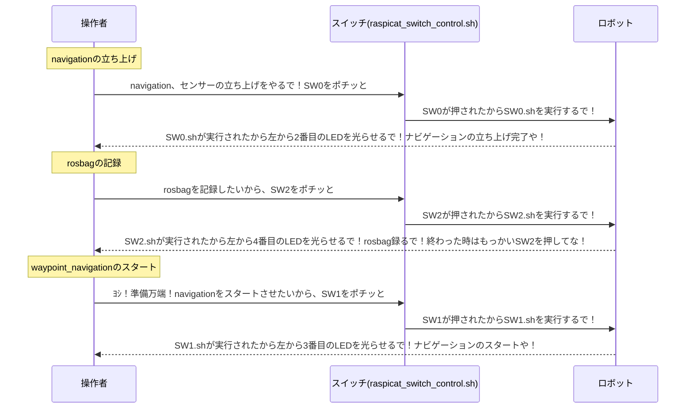

# raspicat_switch_control


# パッケージ概要
Raspberry Pi Catに搭載されているRaspberry Piのみでナビゲーションを行う際に、スイッチ(SW{0,1,2})を使用し、あらゆる操作行うためのパッケージです。

# 詳細
|      | LEDの点灯について                  | 
| ---- | -------------------------------- | 
| LED0 | ros masterのプロセスが走っている | 
| LED1 | SW0.shの処理が実行中なのか       | 
| LED2 | SW1.shの処理が実行中なのか       | 
| LED3 | SW2.shの処理が実行中なのか       | 

|     | スイッチ(SW{0,1,2})を押した場合について   | 
| --- | --------------------------- | 
| SW0 | SW0.shの処理の{実行,終了}   | 
| SW1 | SW1.shの処理の{実行,終了}   | 
| SW2 | SW2.shの処理の{実行,終了}   | 

# 使い方

サービスファイルのコピー
```
sudo cp raspicat_switch_control.service /etc/systemd/system
```

systemdに追加したファイルを反映
```
sudo systemctl daemon-reload
```

自動起動の有効化(起動時に実行されるようになる)
```
sudo systemctl enable raspicat_switch_control.service
```

サービスのスタート
```
sudo systemctl start raspicat_switch_control.service
```

# 使用例

例えば、`SW0をnavigationの立ち上げ`、`SW1をwaypoint_navigationのスタート`、`SW2をrosbagの記録`とした場合、以下のようになる。

他に実装したい機能があれば、SW{0,1,2}.shをそれぞれ編集してください。


